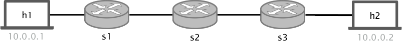
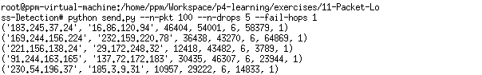
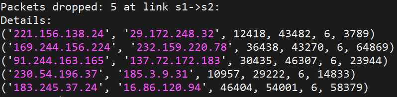
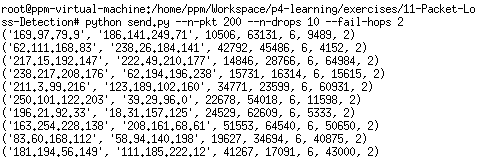
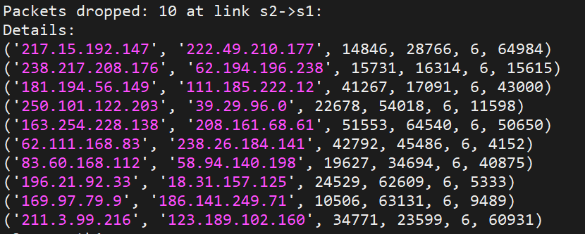

# Packet Loss Detection

## 介绍

参考论文：http://minlanyu.seas.harvard.edu/writeup/conext16.pdf.

背景相关：P4 (Programming Protocol-Independent Packet Processors) 是一种编程语言，用于控制网络设备（如路由器和交换机）中的数据包转发平面。与 C 或 Python 等通用语言相比，P4 是一种特定于领域的语言，具有许多针对网络数据转发进行优化的结构。

bmv2 (behavivoral-model) 是软件交换机，P4编写的代码可以直接编译到bmv2交换机上。

丢包：在当今的网络中，数据包的丢包现象非常普遍。链路故障，链路拥塞或转发表的损坏都可能导致丢包。即使丢包的数量非常小，对网络的性能也会有很大的损坏。所以，快速检测并定位到丢弃的数据包是非常有必要的。

功能介绍：使用P4在bmv2上面实现数据包的丢包检测。

## 实验网络拓扑 

<p align="center">

<br>
<em>Fig. 1: Three hop linear topology</em>
<p/>

## 实验环境：

安装P4运行环境，参考：

https://gitee.com/poohdang/p4-env#%E4%B8%80%E4%B8%BA%E4%BB%80%E4%B9%88%E5%88%86%E4%B8%BA%E4%B8%A4%E4%B8%AA%E8%84%9A%E6%9C%AC

安装P4-Utils：

```bash
wget -O install-p4-dev.sh https://raw.githubusercontent.com/nsg-ethz/p4-utils/master/install-tools/install-p4-dev.sh
bash install-p4-dev.sh
```

更新p4-utils：

```bash
cd ~/p4-tools/p4-utils
git pull
```

## 实验运行

1. 创建网络拓扑, 运行`sudo p4run`或者`sudo python network.py`，shell1

2. 重新打开一个shell，启动控制器，控制平面向交换机发送配置信息，shell2

```
sudo python packet-loss-controller.py --option run
```

3. 测试h1和h2之间是否可以ping通，在shell1中

```
mininet> h1 ping h2
```

4. 在shell1中打开h1的终端，h1向h2发送一些会发生丢包的数据包，h1将会发送100个数据包，5个数据包将会在第1跳的时候丢弃

```
mx h1
python send.py --n-pkt 100 --n-drops 5 --fail-hops 1
```

此时控制器的终端会报告丢弃的数据包，h1终端也会打印丢弃的数据包信息，打印的报告信息如下

<p align="center">

<br>
<em>Fig. 2: h1 loss messages</em>
<p/>

<p align="center">

<br>
<em>Fig. 3: controller print loss messages</em>
<p/>

补充：h1发送数据包到h2的时候，可以设置数据包的数量，丢包的个数，发生丢包的位置

```bash
 parser.add_argument('--n-pkt', help='number of packets', type=int, required=False, default=200)
 parser.add_argument('--n-drops', help='number of packts to drop',type=float, required=False, default=20)
 parser.add_argument('--fail-hops', help='Number of hops until packet is dropped, can be random', type=int, required=False, default=1)

```

5. 打开h2的终端中，h2向h1发送200个数据包，10个数据包将会在第2跳的时候丢弃

```
mx h2
python send.py --n-pkt 200 --n-drops 10 --fail-hops 2
```

<p align="center">

<br>
<em>Fig. 2: h2 loss messages</em>
<p/>

<p align="center">

<br>
<em>Fig. 3: controller print loss messages</em>
<p/>


